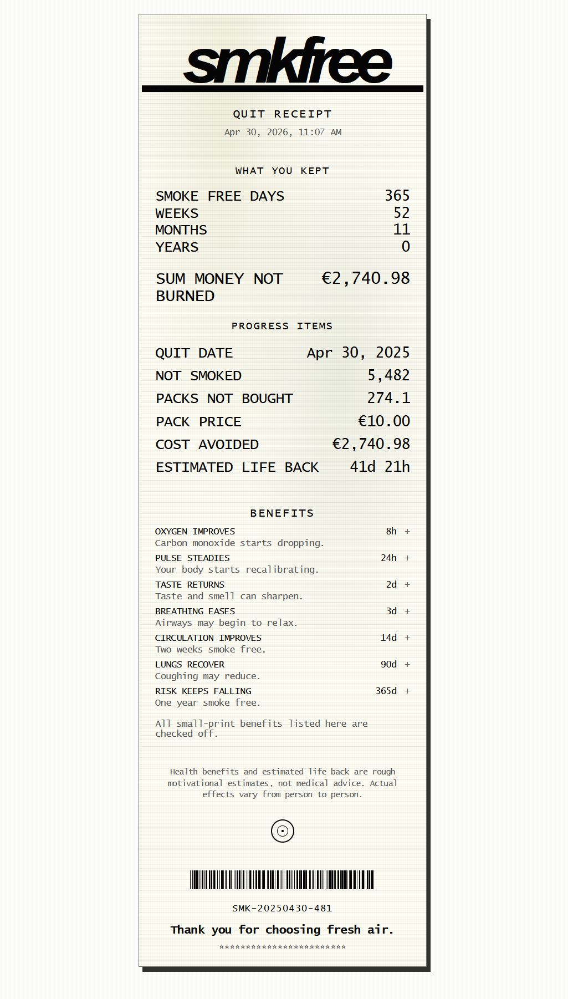

# smkfree

[********************************* SMKFREE ***************************** CLICK ME ***************](https://moritz249.github.io/smkfree/)

SMKFREE is a small static smoke-free tracker that turns quit progress into a receipt-style counter.

Enter a quit date, cigarettes per day, cigarettes per pack, and pack price. The app calculates:

- smoke-free days, weeks, and months
- money not spent on cigarettes
- cigarettes and packs not bought
- estimated life back
- small health milestones

The result is shown as a market-receipt inspired print view.

## Run Locally

Open `index.html` in a browser.

No build step, framework, or backend is required.

## Notes

The health benefits and estimated life back are motivational estimates, not medical advice.

